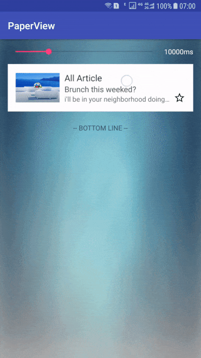
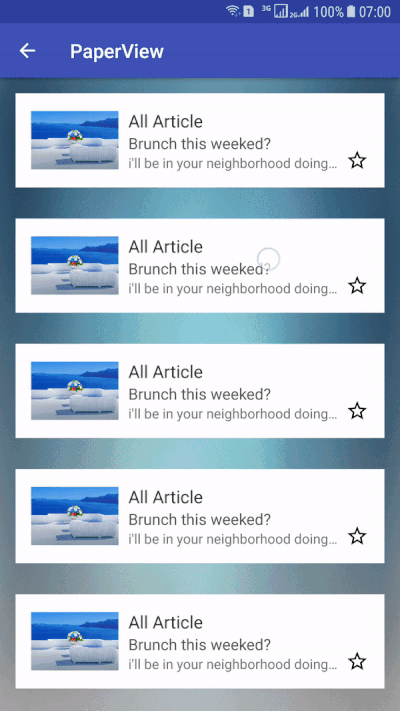

# PaperView

##### PaperView 是一个自定义的View，它就像一张纸折叠和展开

### Demo

##### 1.在普通的布局中使用



##### 2.在RecyclerView中使用


### Compile

[  ](https://bintray.com/goyourfly/maven/PaperView/1.0/link)

````java
compile 'com.goyourfly:paperview:latestVersion'
````

### Usage

##### 1.在布局中声明
````xml
<com.goyourfly.library.paper_view.PaperView
    android:id="@+id/paperView"
    android:layout_width="match_parent"
    android:layout_height="wrap_content"
    android:padding="16dp"
    app:paper_bg_color="#fff"
    app:paper_duration="1000">

    <!--展开的布局-->
    <include layout="@layout/item_large" />
    <!--收起的布局-->
    <include layout="@layout/item_small" />

</com.goyourfly.library.paper_view.PaperView>
````
| 参数 | 类型 | 说明 | 默认值 |
|:-:|:-:|:-:|:-:|
| paper\_duration | integer | 动画总时长 | 2000 |
| paper\_bg\_color | color | 纸片背景色 | #FFF |

##### 2.在代码中设置

###### 2.1 展开和折叠
````java
// 折叠卡片
paperView.fold(animator:Boolean,changed:Boolean)

// 展开卡片
paperView.unfold(animator:Boolean,changed:Boolean)
````

###### 2.2 监听状态变化

````java
paperView.setStateChangedListener(object:PaperView.OnFoldStateChangeListener{
	// 折叠
    override fun onFold() {}
	// 展开
    override fun onUnfold() {}
})
````

### License
````java
Copyright 2017-present, GaoYufei
Licensed under the Apache License, Version 2.0 (the "License");
you may not use this file except in compliance with the License.
You may obtain a copy of the License at
http://www.apache.org/licenses/LICENSE-2.0
Unless required by applicable law or agreed to in writing, software
distributed under the License is distributed on an "AS IS" BASIS,
WITHOUT WARRANTIES OR CONDITIONS OF ANY KIND, either express or implied.
See the License for the specific language governing permissions and
limitations under the License.
````